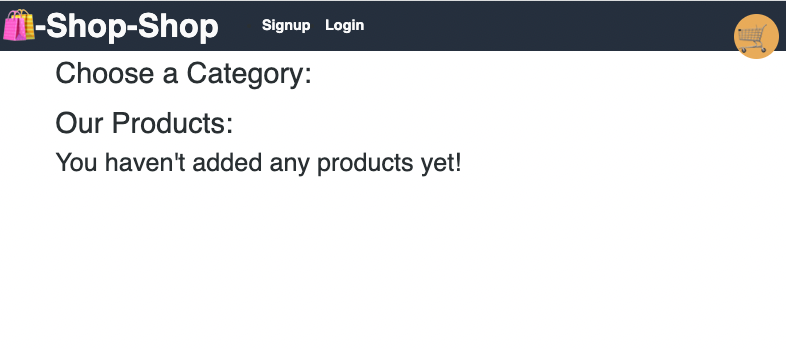

# Redux Store

## Purpose

The purpose of this challenge is to refactor the e-commerce platform code and adapt it so that is uses Redux. As part of this challenge, all components that are called using React's Context API need to be refactored using Redux.

## User Story

```md
AS a senior engineer working on an e-commerce platform
I WANT my platform to use Redux to manage global state instead of the Context API
SO THAT my website's state management is taken out of the React ecosystem
```

## Acceptance Criteria

<li>GIVEN an e-commerce platform that uses Redux to manage global state, WHEN I review the app’s store, THEN I find that the app uses a Redux store instead of the Context API
</li>
<li>WHEN I review the way the React front end accesses the store, THEN I find that the app uses a Redux provider
</li>
<li>WHEN I review the way the app determines changes to its global state
THEN I find that the app passes reducers to a Redux store instead of using the Context API, 
</li>
<li>WHEN I review the way the app extracts state data from the store, THEN I find that the app uses Redux instead of the Context API
</li>
<li>WHEN the toggle is set to Signup, THEN I am presented with three inputs for a username, an email address, and a password, and a signup button</li>
<li>WHEN I review the way the app dispatches actions, THEN I find that the app uses Redux instead of the Context API
</li>

## Screenshot



## Required URLs

[Heroku deployment URL](https://redux-store-7.herokuapp.com/)

[GitHub repository URL](https://github.com/tornicke/redux-store/)
